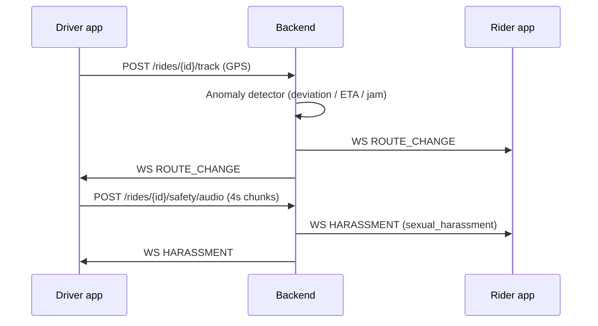

# Rider App Audit (Wasselni)

**Updated:** 2026-05-25

## Fixed in latest pass

| Gap | Status |
|-----|--------|
| Chargily deep link `wasselni://wallet?status=success` | Done — `app.json` scheme + `App.tsx` handler + `WALLET_SUCCESS_URL` |
| Guest Wallet / Activity tabs | Done — `AuthRequiredTab` wrapper |
| Push token registration | Done — `pushNotifications.ts` + `expo-notifications` on login |
| 401 auto logout | Done — `handleResponse` + `rider:unauthorized` event |
| Route deviation driver↔rider | Done — `started_at` on accept, GPS track → `location_update` + `ROUTE_CHANGE` WS |
| WS safety payload parsing | Done — `wsEventData()` reads `data` or `payload` |
| In-ride audio harassment (Darija-tuned) | Done — backend classifier + `rideAudioSafety` (expo-av) on both apps |

## Payment flow

Rider books with `cash` or `wallet`. Wallet debited when driver completes ride. Driver notified via `ride_payment_received`.

Chargily top-up only credits rider wallet (not a driver payment event).

## Safety flow (driver ↔ rider)

## In-ride audio (realtime, one mic)

| Question | Answer |
|----------|--------|
| Realtime? | **Near-realtime** (~3–4s): 2.5s record → upload → classify → alert. Not live streaming like a phone call. |
| Rider + driver both record? | **No.** Only the **rider app** records. Driver uploads are ignored server-side. |
| Is conversation saved? | **Only if flagged.** Normal chunks are discarded. **Harassment / aggression / distress** clips are kept as WAV for admin review (`GET /admin/safety/incidents/{id}/audio`). |
| Who gets alerted? | **Both** via WebSocket when the server flags harassment/aggression. |

Rider mic picks up both voices in the cabin (same as a voice note in the car).

Install: `cd rider-app && npx expo install expo-av expo-notifications`

Classifier: `wasselni-backend/internal/safety/audio/` — labels include `sexual_harassment` (Darija-tuned).

## Remaining (lower priority)

- Activity ride receipt / detail screen
- Prune stale `src/api-contracts/` folder
- Full PCM capture (expo-av uploads container audio; WAV path preferred for best accuracy)
- i18n for Login / Help hardcoded EN strings
